### Table of contents

[1. Create client ID of grafana](#createclient)

[2. Create client secret](#clientsecret)

[3. Get your client secret ](#getsecret)

[4. Add roles for grafana on SSO](#addssoroles)

[5. Add mapper](#addmapper)

# Grafana

Grafana has it owns user management, but to reduce the multiple login times they provide us another way to do that by using Oauth like Keycloak. This post will describe how to configure Grafana to use Keycloak as an authentication provider.
The grafana documentation explains how to integrate an [OpenID provider]( https://grafana.com/docs/grafana/latest/auth/generic-oauth/).

<a name="createclient"></a>
# 1. Create client ID of grafana

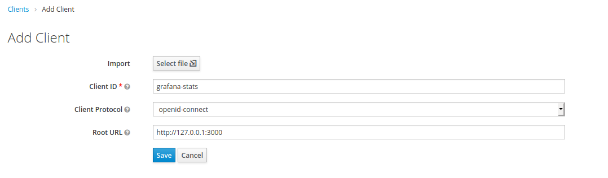

Type your client ID and select `Client Protocol` in here we choose `opened-connect` and my Grafana app running as URL http://127.0.0.1:3000

<a name="clientsecret"></a>
# 2. Create client secret.

Select your client (you done in step 1) as picture below
 
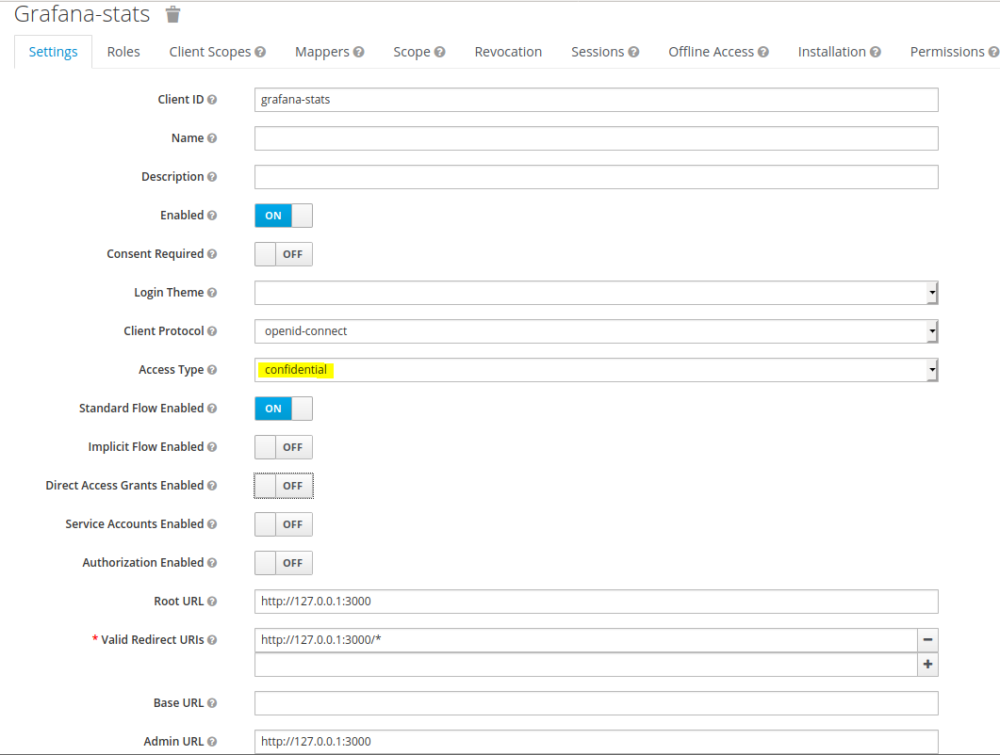

Change `Access Type` to `confidential` and add the suitable URL for your app. Then click save.

<a name="getsecret"></a>
# 3. Get your client secret 

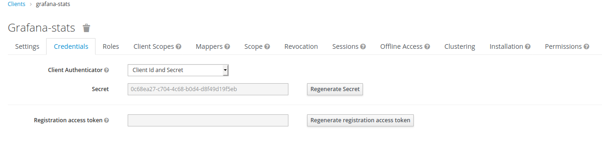

<a name="addssoroles"></a>
# 4. Add roles for grafana on SSO


 
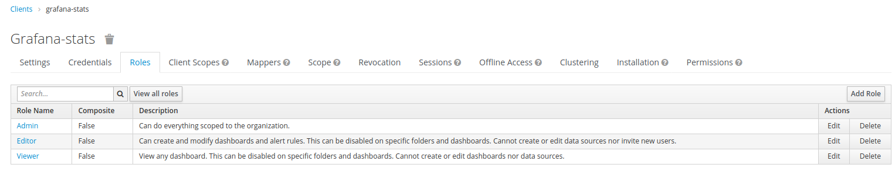

You can see more at https://grafana.com/docs/grafana/latest/permissions/organization_roles/

<a name="addmapper"></a>
# 5. Add mapper
 
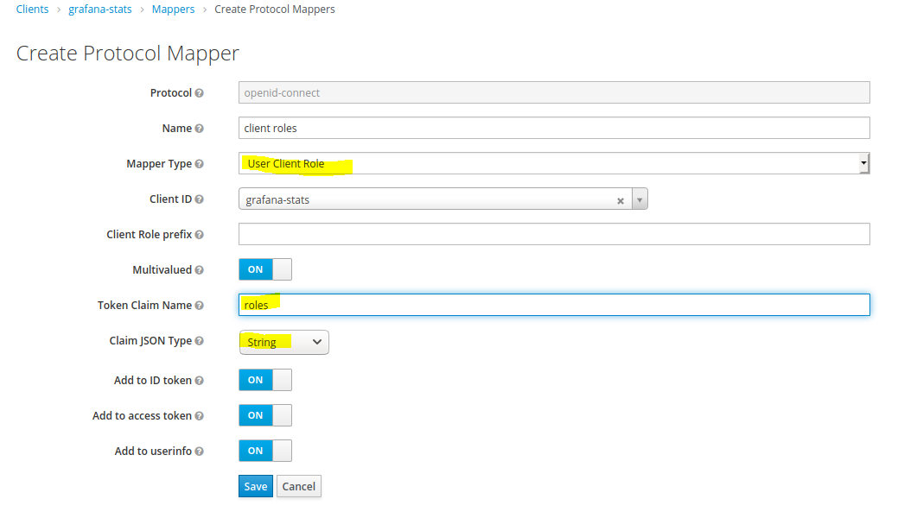

* Choose mapper type is `User Client Role`
* Set value of Token Claim Name is `roles`
* Choose type `String` for Claim JSON Type.
* Then select ON for 3 buttons then Save.

So we just finished the setting in Keycloak site. Now we move on setting in grafana

See how to define env variables at https://grafana.com/docs/grafana/latest/installation/configuration/

Here is sample setting in `grafana.ini`.

Some variables were defined in environment variables check .env file for more detail

```
[server]
enforce_domain = false
[auth]
disable_login_form = true
oauth_auto_login = true

[auth.grafana_com]
; See how to define env variables at https://grafana.com/docs/grafana/latest/installation/configuration/
[auth.generic_oauth]
enabled = true
name = OAuth
allow_sign_up = true

scopes = openid
; Set role using JMESPath https://grafana.com/docs/grafana/latest/auth/generic-oauth/#jmespath-examples
; Set View permission if roles not defined
role_attribute_path = contains(not_null(roles[*],''), 'Admin') && 'Admin' || contains(not_null(roles[*],''), 'Editor') && 'Editor' || contains(not_null(roles[*],''), 'Viewer') && 'Viewer'|| ''

[auth.basic]
enabled = false
[security]
disable_initial_admin_creation = true
```

.env
```
#SERVER CONFIGURE
GF_SERVER_ROOT_URL=http://127.0.0.1:3000  (Put your host here)

#SSO
GF_AUTH_GENERIC_OAUTH_CLIENT_ID=lbn-ttc-grafana-stats (Set your client id in here)
GF_AUTH_GENERIC_OAUTH_CLIENT_SECRET=XXXXXXX-XXXX-XXXXXX (Put your client secret)
GF_AUTH_GENERIC_OAUTH_AUTH_URL=https://$KEYCLOAK_URL/auth/realms/lbn/protocol/openid-connect/auth
GF_AUTH_GENERIC_OAUTH_TOKEN_URL=https://$KEYCLOAK_URL/auth/realms/lbn/protocol/openid-connect/token
GF_AUTH_GENERIC_OAUTH_API_URL=https://$KEYCLOAK_URL/auth/realms/lbn/protocol/openid-connect/userinfo
GF_AUTH_SIGNOUT_REDIRECT_URL=https://$KEYCLOAK_URL/auth/realms/lbn/protocol/openid-connect/logout?redirect_uri=http://127.0.0.1:3000/ (Set your redirect URL)
```
Test your login when access grafana.
 
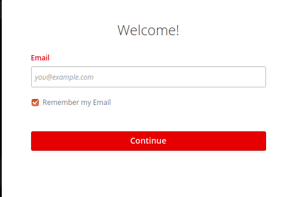

After login succeesfull we can access to the dashboard.
 
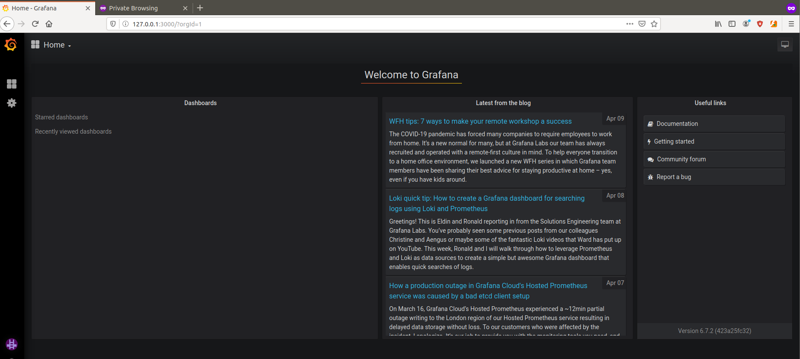

How can we manage the user permission via SSO while grafana provided them in their dashboard?

By default, the user’s role was set as `Viewer`, If you change the permission of users in Keycloak 

Now I set the account with the `Admin` role in SSO.
 
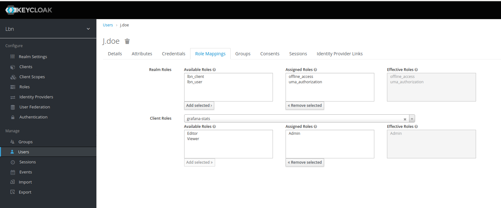
When you login to the grafana dashboard this account will be set the `Admin` permission.
 
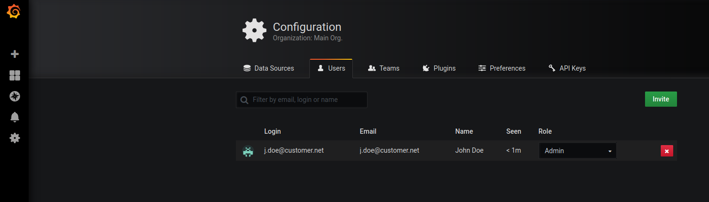

The rights set on keycloak will be overrided the roles set in the Grafana dashboard. You can change this rule by update `role_attribute_path` that was defined in garafana config file.

So what will happen if you don't set any permission for users in Keycloak?

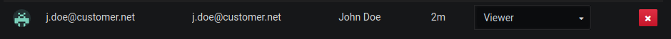

-> The user's role will be set base on roles set in Grafana dashboard.

Now, I remove the role Admin that I set for this user before .


Login again we can see the role was set for this user is `Viewer`
 
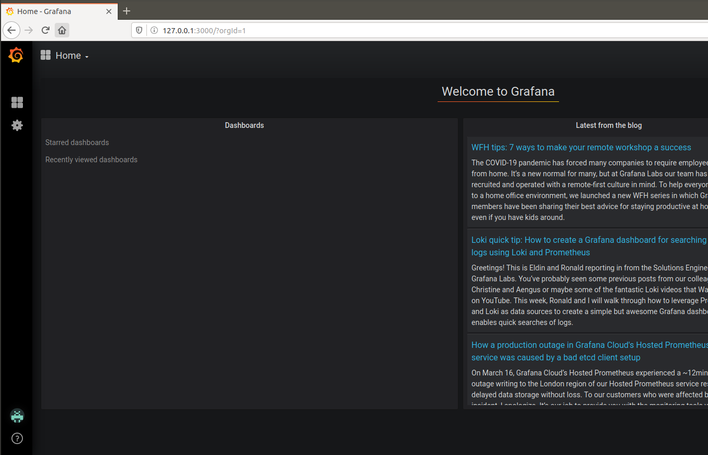
